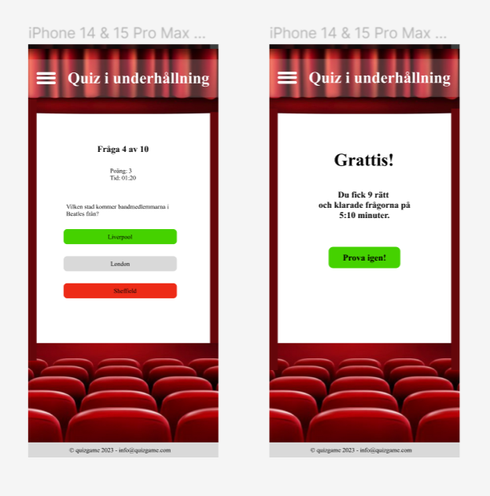
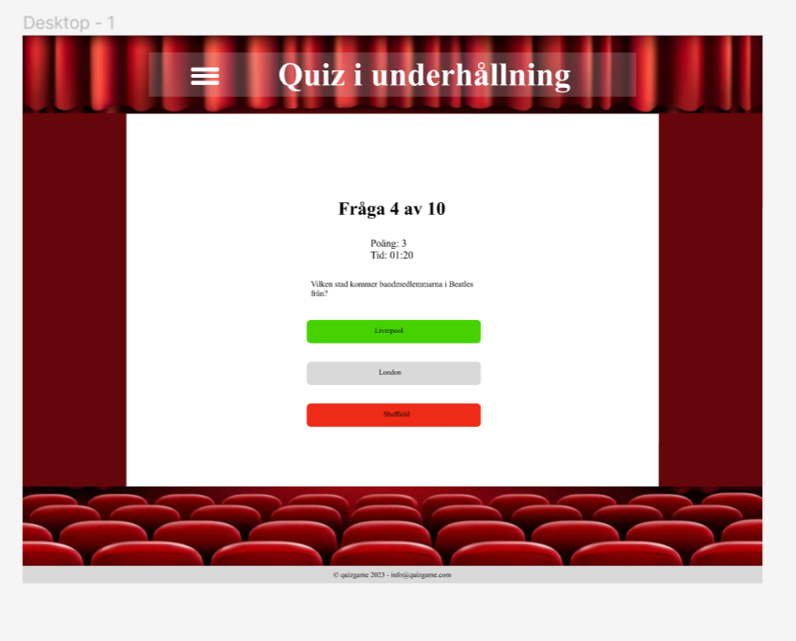
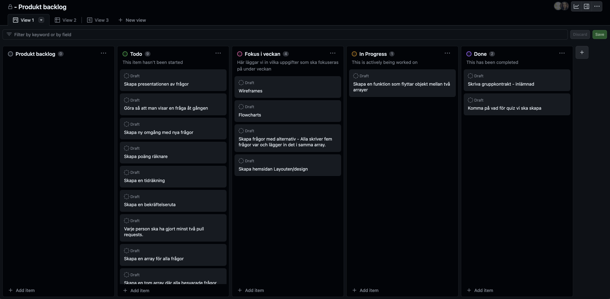
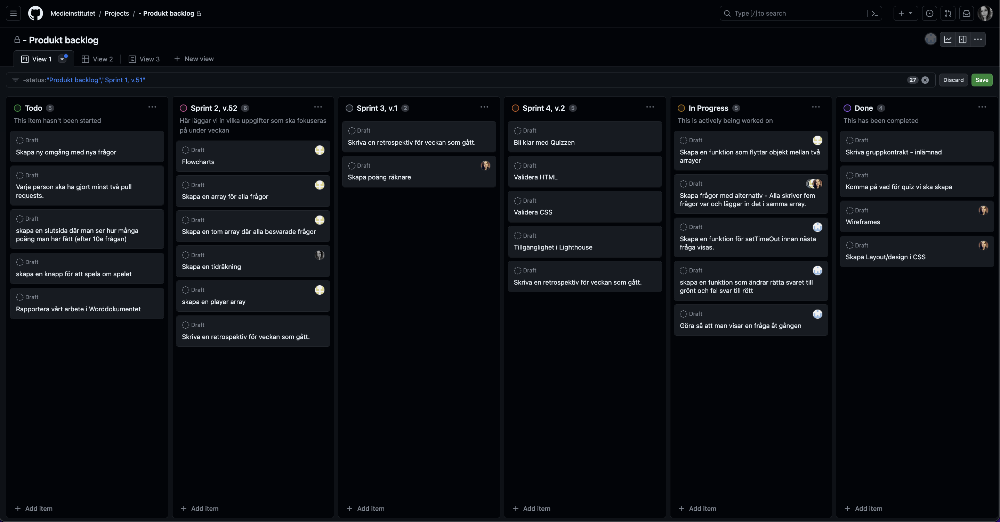
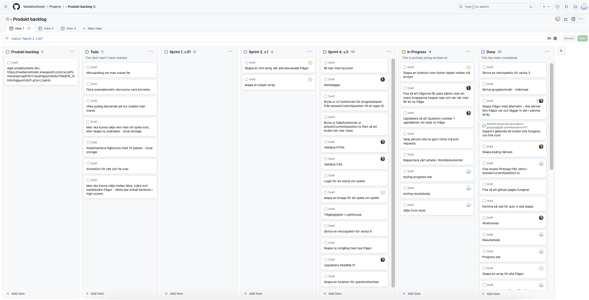
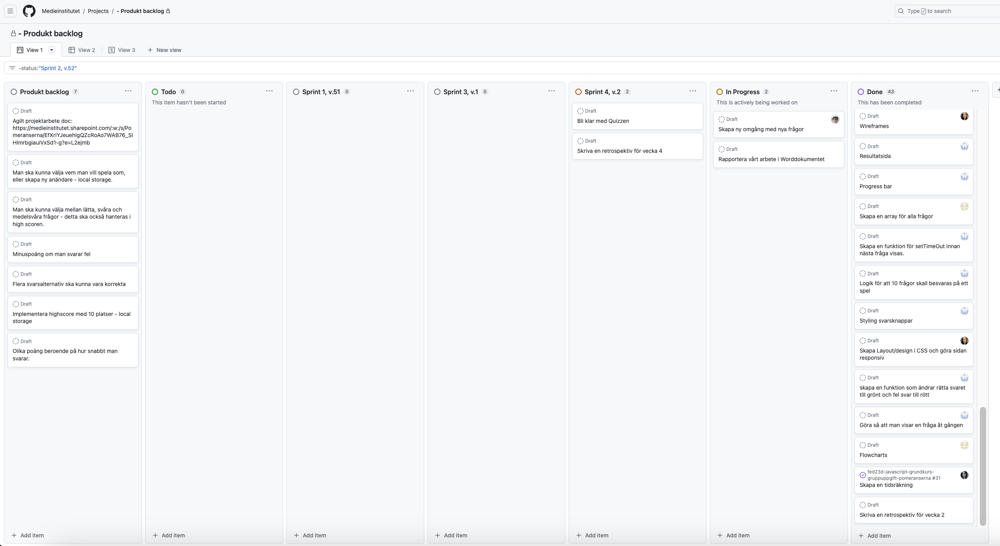
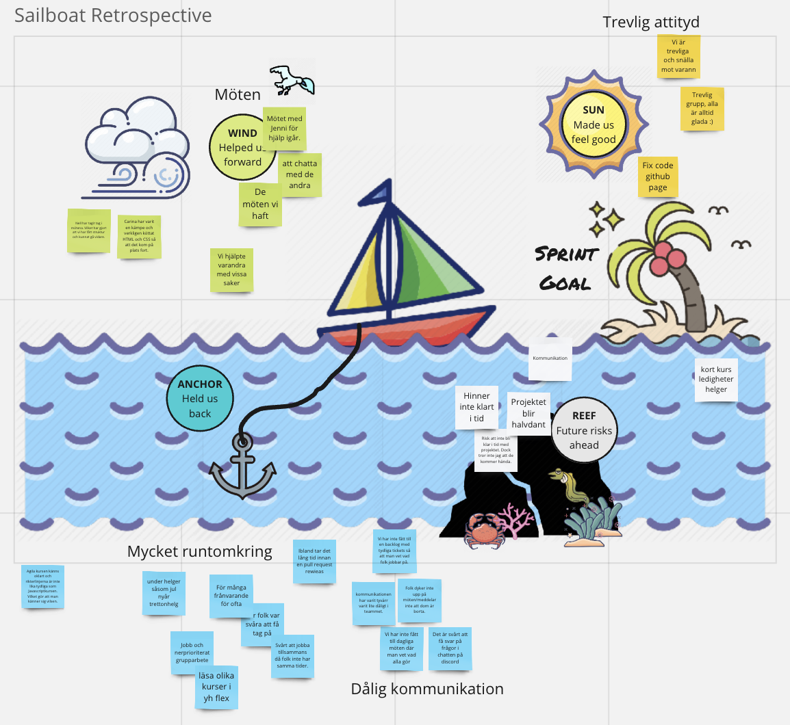
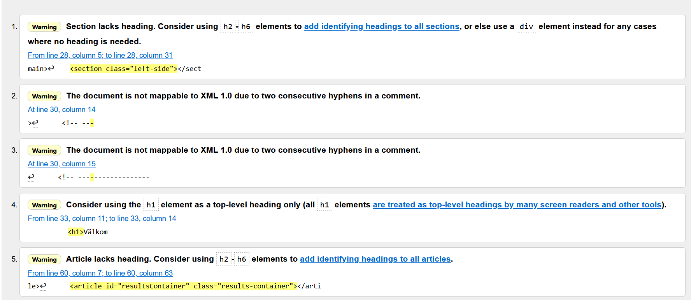
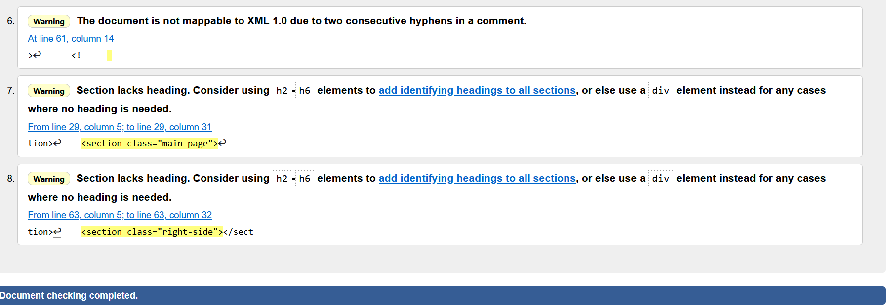
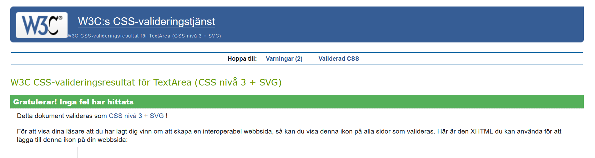

# Projektbeskrivning: 📃
Vi har fått i uppdrag att skapa en quiz, med hjälp av de kunskaper vi har fått hittills i våra kurser på Medieinstitutet - HTML, CSS, SCSS, samt Javascript som vi lär oss just nu. Vår grupp bestämde oss för en Quiz i underhållning. Vi som arbetar med projektet är: Nell Andersson, Carina Lakosil, Yesenia Martinez och Michael Inma. Vi har fyra veckor på oss att slutföra arbetet, dec 2023 - jan 2024. Med den här uppgiften har vi två olika skolämnen vi ska få betyg i: JavaScript grund samt Agilt projektarbete. Därför bifogar vi bilder på vår backlog här, så man ser hur processen har gått till under de fyra veckor vi jobbade på det.
# Verktyg  	🔧
JavaScript  
TypeScript  
HTML  
CSS  
SCSS  
Visual Studio Code  

# Projektmall FED23D
Läs instruktionerna på kurswebben för att komma igång.

## Betyg
Klicka i vilka krav ni har gjort:

- [x] Exempel på utförd/ikryssad uppgift
- [ ] Ej utförd uppgift

### För Icke Godkänt
- [ ] Du har inte deltagit i arbetet och/eller gjort commits (det syns tydligt i Insights-fliken på ert repo)
- [ ] Du/ni har inte följt instruktionerna
- [ ] Du/ni uppvisar avsaknad av kunskaper i såväl HTML, CSS som JavaScript och du/ni har ignorerat semantik och tillgänglighet

### För Godkänt
#### Kodkvalitet
- [ ] Koden är korrekt formaterad.
- [ ] Koden innehåller enstaka buggar, men fungerar på det stora hela.
- [ ] Ni har gjort åtminstone en mobilversion; om ni återanvänder samma layout i tablet/desktop så går det bra.
- [ ] Sidan ska vara någorlunda snygg (CSS).
- [ ] Ni har checkat av "vanliga misstag" från tidigare uppgifter, såväl HTML & CSS som JavaScript.
- [ ] Sidan är tillgänglighetsgranskad.
- [ ] Sidan är validerad.
- [ ] Ni har gjort en Lighthouse-analys på live-sidan.

#### Funktionsbeskrivning
- [ ] Skapa ett quiz med minst 20 frågor
- [ ] Varje fråga ska ha 3 svarsalternativ och endast 1 svarsalternativ ska vara korrekt
- [ ] Frågorna ska presenteras i slumpmässig ordning, och du ska visa 10 frågor per spelomgång
- [ ] Om användaren väljer att spela igen, så ska inte samma 10 frågor komma upp på nytt
- [ ] Du ska få poäng för rätt svar
- [ ] Det ska bara visas en fråga åt gången på skärmen
- [ ] Det ska finnas en tidräkning (uppåt). Tidräkningen ska stanna när alla frågor har besvarats.
- [ ] Det ska visas en bekräftelseruta som visar hur många frågor spelaren svarade rätt på (av totalt antal frågor), och hur lång tid det tog.
- [ ] Varje person ska ha gjort minst två pull requests.

### För plus i kanten
#### Kodkvalitet
- [ ] Koden följer konventioner och praxis.
- [ ] Projektets utförande är ambitiöst och väl genomarbetat. Ni har inte tagit på er för mycket, utan sett till att det ni har är genomarbetat.
- [ ] Ni har tagit höjd för responsiv design (CSS) och CSS:en är välskriven.
- [ ] Koden är korrekt formaterad med ESLint och Prettier.
- [ ] Projektets kod är självdokumenterande. Där det är otydligt har du skrivit till kommentarer. Exempelvis heter variabler och funktioner på ett sådant sätt att det är tydligt vad de gör.
- [ ] Ni har aktivt arbetat för att minska kodupprepning, men det är OK om det förekommer en del. Ibland kan kodupprepning t.ex. vara bra för att koden blir tydligare att läsa, så all upprepning är inte av ondo.
- [ ] Ingen spaghettikod :spaghetti:
- [ ] Anonyma funktioner används med omsorg.
- [ ] Koden och projektet har en logisk struktur.
- [ ] Ni har skrivit en ordentlig README (projektbeskrivning, skrämdumpar, deltagare i arbetet).

#### Funktionsbeskrivning
- [ ] Det ska finnas en "progess bar" som visar hur många av frågorna som hittills har besvarats
- [ ] Flera svarsalternativ ska kunna vara korrekta
- [ ] Du får olika poäng beroende på hur snabbt du svarar på frågan (ni får komma på själva hur det ska funka, dokumentera i README:n)
- [ ] Du får minuspoäng om du svarar fel
- [ ] Du ska kunna välja vem du vill spela som, eller skapa en ny användare (förutsättningen här är att man använder samma webbläsare; använd local storage). Se exempelskiss nedan.
- [ ] Implementera ett highscore (max 10 platser) med hjälp av local storage
- [ ] Det ska finnas med en animation för rätt svar, och en animation för fel svar. Det kan t.ex. vara en stjärna som roterar, byter färg, eller en knapp som skakar. Vad ni gör spelar ingen roll, men ni ska implementera det med hjälp av GSAP.
- Välj ett av nedan:
  - [ ] Man ska kunna välja att spela mellan lätta, medelsvåra och svåra frågor. Planera hur detta påverkar highscoren.
  - [ ] Det ska vara som en julkalender: bakom varje lucka (24 st) så visas det X antal nya frågor per dag.

### Wireframe för mobilversion ser ut såhär:  
    
### Wireframe för tablet och desktopversion ser ut såhär:  
    
### Flowchart för sidan:  
  

# Produkt Backlog

## Vecka 1
  
## Vecka 2
 
## Vecka 3
 
## Vecka 4
 
## Sailboat Retrospective
### Vi gjorde en Sailboat retrospective:  

## Validering av HTML

## Validering av CSS

